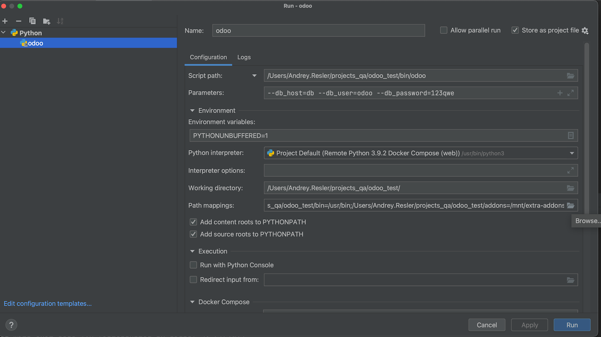
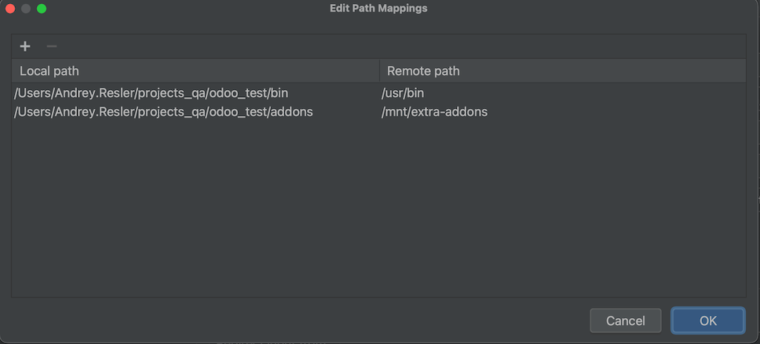

Minimal Odoo project to test PyCharm debugger.

1. Create docker-compose interpreter for the `web` service.

*Path to the interpreter is `/usr/bin/python3`.*

2. Create a run/debug configuration like the following:

*Note the parameters*

3. An example of path mappings:

4. Run the web service, [open in browser](http://localhost:8069), finish initial setup.

5. [Install the module `my_module`](https://www.odoo.com/documentation/16.0/administration/odoo_sh/getting_started/first_module.html#install-your-module)

*For the settings to become active, you may need to install one of the apps, e.g. "Sales"*

6. Place a breakpoint in the [controller script](https://github.com/aresler/odoo-dbg-test/blob/cb714de60a78f56ed30546445bcd48ff2101a0f4/addons/my_module/controllers/controllers.py#L8)

7. Run configuration with the debugger.

8. Trigger the breakpoint by requesting `http://localhost:8069/my_module/foo` from the web browser or using `curl`.
